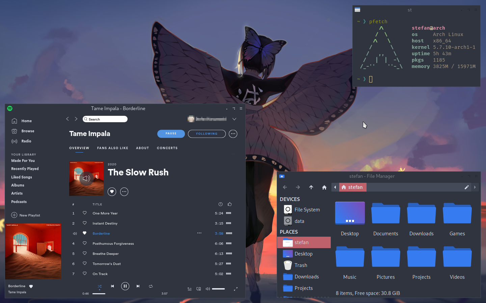
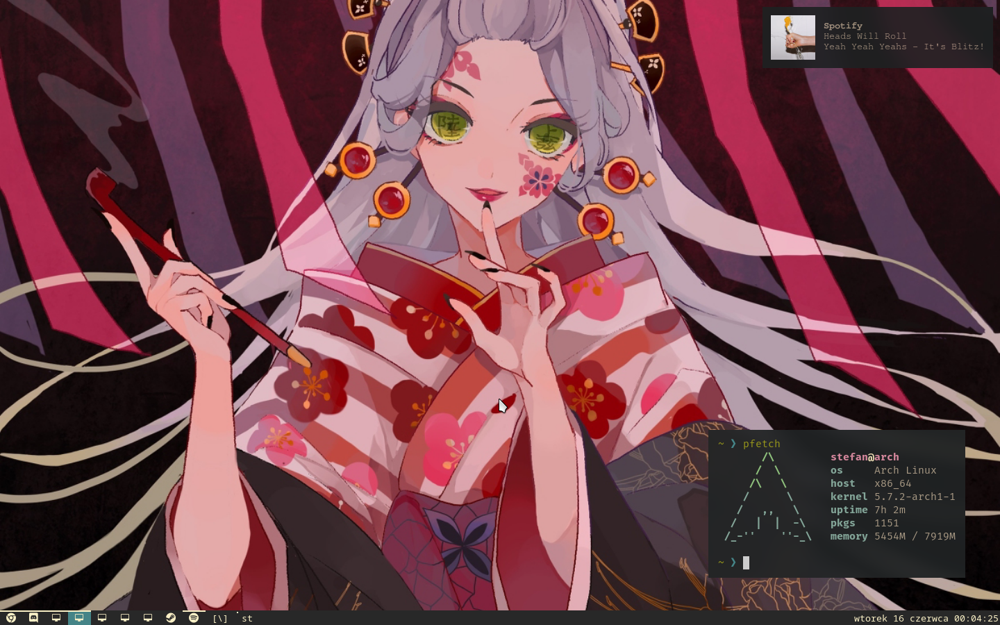
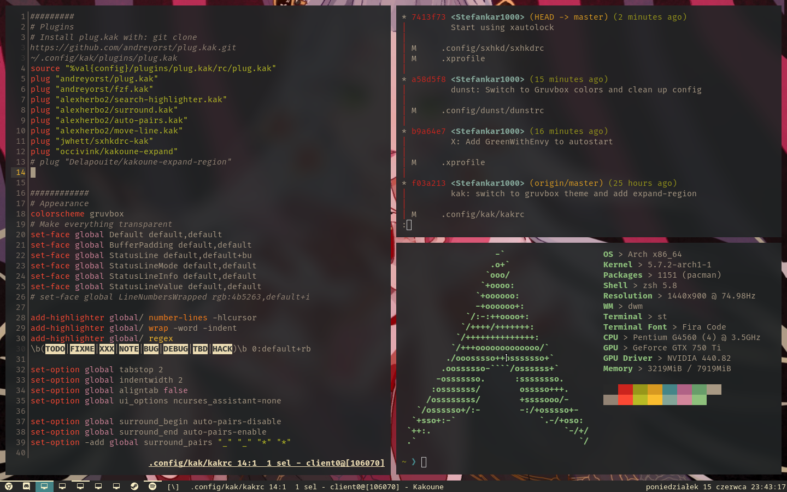
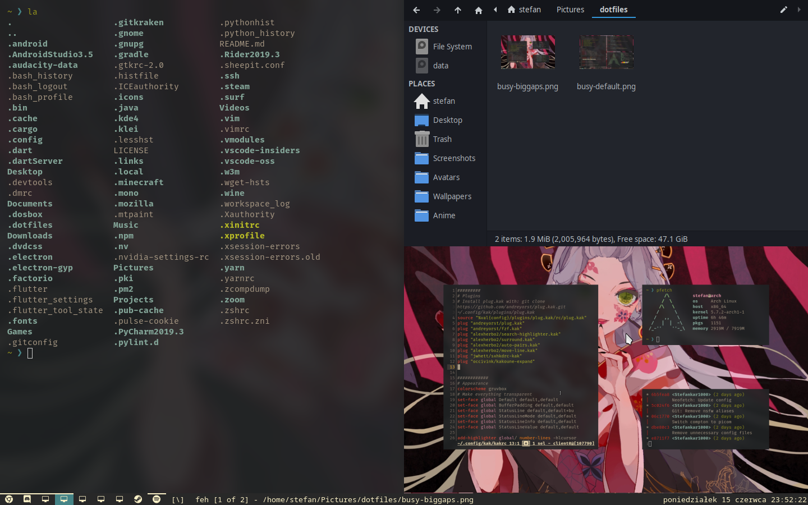

# Dotfiles

# Most important programs
- **Window Managers**:
    - [openbox](../.config/openbox/rc.xml)  (currenly running)
    - [dwm](https://github.com/Stefankar1000/dwm)
- **Terminal**: [st](https://github.com/Stefankar1000/st)
- **Compositor**: [picom](../.config/picom.conf)
- **Notifications**: [dunst](../.config/dunst/dunstrc)
- **Dock**: [tint2](../.config/tint2/tint2rc)
- **Editor**: [kakoune](../.config/kak/kakrc)
- **Shell**: [zsh](../.zshrc)
- **Keyboard shortcuts**: [sxhkd](../.config/sxhkd/sxhkdrc)
- **Lock**: betterlockscreen, xautolock

# Scripts [.local/bin](.local/bin)
- **[screenshot-full](.local/bin/screenshot-full)**: takes a screeshot of the entire screen, copies it to the clipboard and saves to `~/Pictures/screenshots` (make sure that this folder exists before using any screenshot scripts)
- **[screenshots-window](.local/bin/screenshot-window)**: same as screenshot-full, but only captures the currently focused window
- **[screenshot-snippet](.local/bin/screenshot-snippet)**: freezes the screen and lets you take a screenshot of an area of the screen
- **[dwm-status](.local/bin/setdwmstatus)**: dwm status bar script with support quickly adding custom modules

# Screenshots

    
Openbox

    Busy desktop
    

    
Dwm

    Clean desktop + notification
    
    Default window layout
    
    Gaps turned off
    
    Big gaps
    

