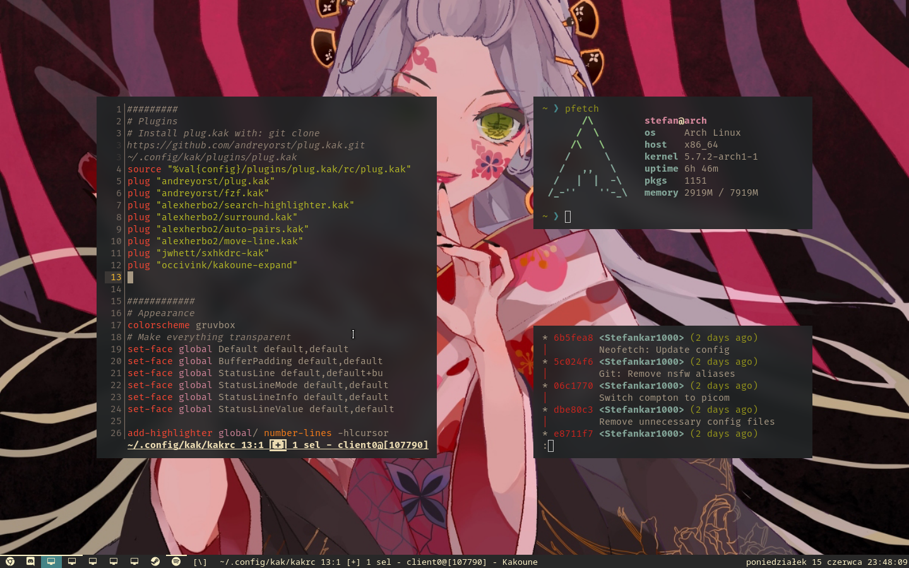

# Dotfiles

# Most important programs
- **Window Manager**: [dwm](https://github.com/Stefankar1000/dwm)
- **Terminal**: [st](https://github.com/Stefankar1000/st)
- **Compositor**: [picom](../.config/picom.conf)
- **Notifications**: [dunst](../.config/dunst/dunstrc)
- **Editor**: [kakoune](../.config/kak/kakrc)
- **Shell**: [zsh](../.zshrc)
- **Keyboard shortcuts**: [sxhkd](../.config/sxhkd/sxhkdrc)
- **Lock**: betterlockscreen, xautolock

# Scripts [.local/bin](.local/bin)
- **[screenshot-full](.local/bin/screenshot-full)**: takes a screeshot of the entire screen, copies it to the clipboard and saves to `~/Pictures/screenshots` (make sure that this folder exists before using any screenshot scripts)
- **[screenshots-window](.local/bin/screenshot-window)**: same as screenshot-full, but only captures the currently focused window
- **[screenshot-snippet](.local/bin/screenshot-snippet)**: freezes the screen and lets you take a screenshot of an area of the screen
- **[setdwmstatus](.local/bin/setdwmstatus)**: temporary script for updating dwm's status with the current day and hour (runs in a loop)

# Screenshots
Clean desktop + notification

Default window layout

Gaps turned off

Big gaps

